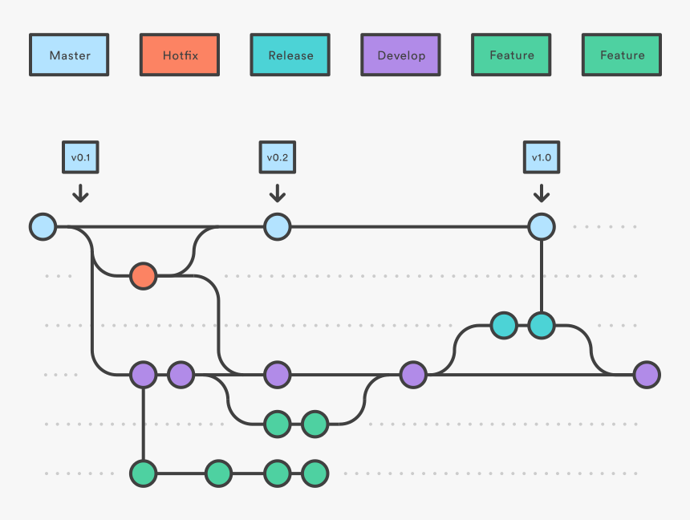

# Git, CLI and Editor

## Command Line

Understand what is the Terminal on Mac or CMD on Windows. Understand basic commands like:

* Check and change current directory
* Create and remove directories
* Copy and move files
* See content of a file
* List content of a directory

## Git and GitHub

How the Git Flow works

```
$ git clone
```





 Good book from launchschool: [https://launchschool.com/books/git](https://launchschool.com/books/git)

Another from git itself: [https://git-scm.com/book/en/v2/Getting-Started-What-is-Git%3F](https://git-scm.com/book/en/v2/Getting-Started-What-is-Git%3F)



A very good cheat sheet: [https://github.github.com/training-kit/downloads/github-git-cheat-sheet.pdf](https://github.github.com/training-kit/downloads/github-git-cheat-sheet.pdf)



## Choose and Editor

* VSCODE / Visual Studio Code / Code
* ATOM
* Sublime Text


